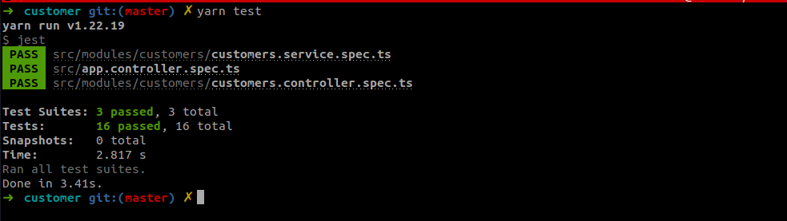

# Customer CRUD

[]()

## Backend
##### Requirement
- NodeJS >= 14
- MongoDB
##### Install
`yarn install`
##### Environment
Copy `.env.example` to `.env`
Modify your environment:
```
NODE_ENV=development
HOST=127.0.0.1
PORT=3000

# Mongo
MONGO_URL=mongodb://localhost:27017/customers

```
##### Run app on development
`yarn start:dev`
See `Application is running on: http://127.0.0.1:3000` in terminal.
#### API Docs
See Swagger api at enpoint: `http://localhost:3000/api/docs/#/`
#### Testing
`yarn test`


## Run application via Docker
You can run application with just a command via docker-compose
- Make sure your machine installed [Docker](https://docs.docker.com/engine/install/ubuntu) and [Docker compose](https://docs.docker.com/compose/install/)
- Make sure mongodb in your machine is down to avoid port conflict at 27017
Command: `docker-compose up -d`
